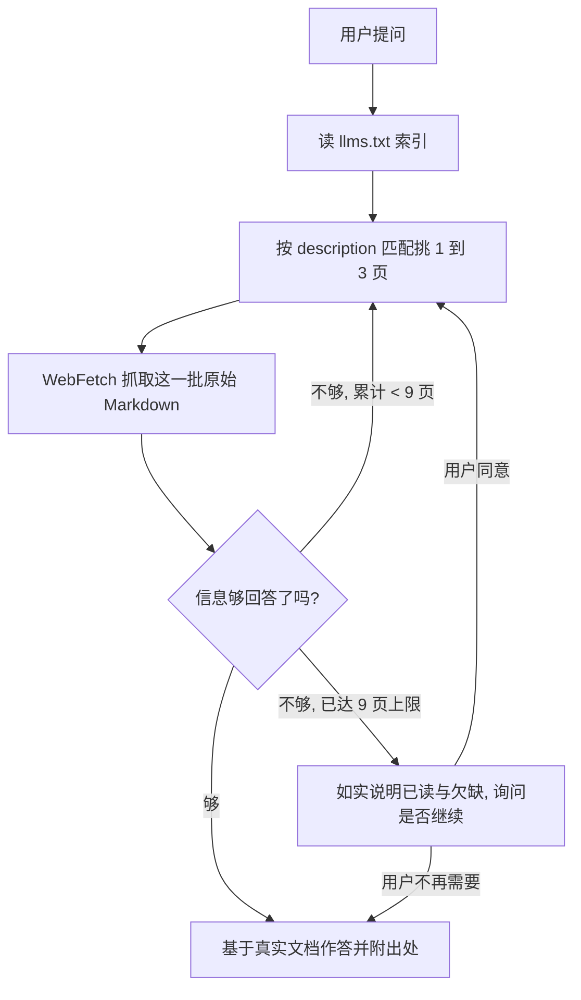

# Claude Code 文档索引 Skill

这个 Skill 让 agent 在需要了解 Claude Code 时，不再依赖训练时记住的、可能已经过期的知识，而是去读官方文档的最新版本。Claude Code 的命令、配置项、hooks、MCP、权限模型几乎每周都在变，靠记忆回答很容易出错。这个 Skill 的作用就是把「先查官方文档、再回答」这件事固化成一个稳定流程。

---

## 1. 它解决什么问题

假设你要写一段关于 Claude Code hooks 的说明，或者你在配置 MCP 时遇到了报错，又或者你想知道某个 settings 字段到底是什么含义。这些问题的答案都在官方文档里，而且官方文档随时会更新。如果直接凭印象回答，你给出的 slug、字段名、命令格式很可能已经被改掉了。

这个 Skill 的定位很单纯：凡是关于 Claude Code 本身的问题，它都先去官方索引里找到对应页面，抓取当前内容，再基于真实文档作答。它覆盖 Claude Code CLI（slash 命令、settings、权限、hooks、MCP、plugins、subagents、skills、CLAUDE.md 记忆等）、Claude Agent SDK（Python 与 TypeScript）、以及各类 IDE、部署、CI 和管理员场景。

需要区分一个边界：如果问题是关于 Anthropic API 或 Anthropic SDK 本身，而不是 Claude Code 这个工具，那应该走 `claude-api` Skill，而不是这个。

---

## 2. 怎么用

大多数时候你什么都不用做。当你手头的任务依赖 Claude Code 的官方信息时，直接触发这个 Skill，它会自己完成查询。你可以把一个具体话题作为参数传进去（比如 `hooks` 或 `MCP setup`），也可以什么都不传，让它从当前对话里自己推断你要查的主题。

它的输出会落在真实文档内容上，并在陈述不那么显然的事实时附上文档标题和 URL，方便你回去核对。换句话说，你从它这里拿到的不是一段综合了旧知识的复述，而是当前官方文档怎么说，它就怎么传达。

一句话总结前半段：只要你要做的事情依赖 Claude Code agent 的官方最新信息，参考这个 Skill 就够了。

---

## 3. 底层原理，给维护者看

从这里往下是写给维护这个 Skill 的人看的，讲清楚它到底是怎么被造出来的，为什么这么设计。

整个 Skill 的核心思想是惰性加载（lazy load）。它不把上百页文档塞进 prompt，而是只依赖一个入口，也就是官方维护的索引文件 https://code.claude.com/docs/llms.txt 。这个索引是一个扁平的列表，大约一百五十条，每一条长这样：

```
- [Title](https://code.claude.com/docs/en/<slug>.md): description
```

注意每个 URL 都以 `.md` 结尾，抓下来的是原始 Markdown，不是渲染后的 HTML，这让内容对 agent 更友好。

---

## 4. 工作流程是怎么设计的

Skill 的执行分成几步，而且核心是一个「小批次 + 评估 + 循环」的过程，不是一次性读完就结束。

第一步是读索引。它用 `WebFetch` 把 `llms.txt` 整个抓下来，要求返回未经改动的原始 Markdown，保留每一条 `- [Title](URL): description`。这一步不能跳过，哪怕你觉得自己记得目标 URL。因为文档的 slug 会被重命名，索引才是唯一可信的真相来源。

第二步是挑页面。它拿用户的问题去和每一条的 description（冒号后面那段描述）做匹配，而不是只看标题。匹配时有几条纪律：一个批次只挑一到三页，索引是用来分诊的，不是用来批量灌数据的；一个具体的功能问题对应一页；跨概念的问题（比如「skills 和 subagents 是什么关系」）才分别抓多页；如果索引里没有明显匹配的条目，就如实说没有，绝不去猜一个 URL。

第三步是抓取这一批。对每个选中的 URL 发一次 `WebFetch`，prompt 写成一个能捕捉用户真实需求的问题，而不是笼统的「总结这一页」。

第四步是评估，然后决定回答还是继续循环。这是关键的一步：抓完一批之后，先判断这些内容够不够回答用户的问题。够了，就基于抓回来的内容作答并附上出处；不够（答案其实在另一页、或某一页指向了别的页面），就回到第二步，再挑下一批一到三页继续抓。这个循环会一直走下去，直到能回答为止，但设了一个默认上限：全过程最多读九页。如果读满九页还是不够，就停下来，如实告诉用户已经读了哪些、还缺什么，并询问要不要继续读更多页——既不偷偷突破上限，也不用猜测去填补空缺。



---

## 5. 几条硬规则背后的道理

这个 Skill 有几条看起来很严的规则，每一条都对应一个真实的失败模式，维护时不要轻易放宽。

不许编造文档 URL，是因为一旦允许猜 slug，agent 就会在页面不存在时凭直觉拼出一个看似合理却错误的地址，把用户引到 404 或错误内容。宁可说「索引里没有」。

不许跳过读索引这一步，是因为 slug 会改名，缓存在模型里的旧地址迟早失效，只有每次重新读索引才能拿到当前有效的映射。

必须守住范围，只覆盖 `code.claude.com/docs/*`，是为了和 `claude-api` 这个 Skill 划清边界，避免两者互相污染答案。

尽量原样传达文档内容，不要激进地和旧知识融合，是因为用户要的是当前权威行为，而不是一份掺了过时假设的综述。

之所以采用「小批次循环 + 九页上限 + 到顶就问用户」这套机制，而不是一次抓一大堆或者无限抓下去，是因为要在两种失败模式之间取平衡。一次抓太多会把无关内容灌进上下文、稀释信号；而遇到复杂问题只抓一批又常常不够。小批次让每一步都带着「够不够」的判断前进，循环保证信息不足时会继续补，九页的上限则防止在找不到答案时无声地烧掉大量抓取。到顶之后把选择权交回用户，是因为「继续深挖还是就此打住」本质上是用户的判断，Skill 不应该替他们默默决定，更不该用猜测把答案凑齐。

理解了这五节，你就能明白这个 Skill 为什么只有一个入口文件、为什么严格限制抓取页数、为什么把「先查再答」写死成流程。它本质上是一台把「官方文档」转化成「可复用 agent 能力」的小机器，而可靠性来自于它始终从同一个可信索引出发。
